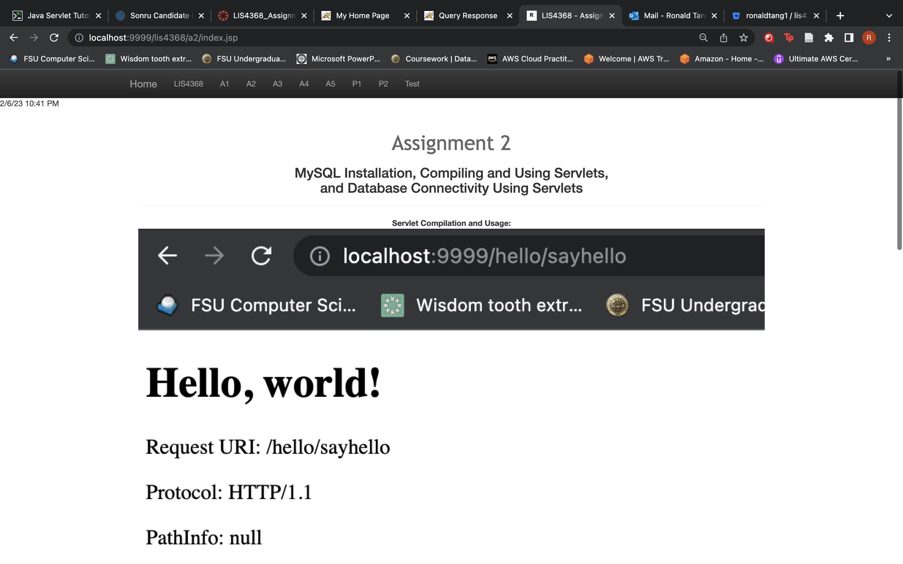

# LIS 4368 - Advanced Web Applications Development 

## Ronald Tang

### Assignment 2 Requirements:

*Five parts:*

1. http://localhost:9999/hello(Displays directory! It should not! Needs index.html)
2. http://localhost:9999/hello/HelloHome.html(Rename"HelloHome.html" to "index.html"so that users cannot see your files!)
3. http://localhost:9999/hello/sayhello(invokes HelloServlet) Note: /sayhello maps to HelloServlet.class(changed web.xml file)
4. http://localhost:9999/hello/querybook.html
5. http://localhost:9999/hello/sayhi (invokes AnotherHelloServlet)

#### README.md file should include the following items:

* Screenshot of running servlets
* Screenshot of skillsets
* Bitbucket repo links

#### Assignment Screenshots:

| Screenshot of running Hello | Screenshot of HelloServlet | Screenshot of Query Book |
| ---------- | ---------- | ---------- |
|  |  |  |

| Screenshot of Query Results| Screenshot of A2 index.jsp
| ---------- | ---------- |
|  |  |

| Skillset 1 | Skillset 2 | Skillset 3 |
| ---------- | ---------- | ---------- |
|  |  |  |

#### Bitbucket Link

*Remote repository:*
[My Remote Repository ](https://bitbucket.org/ronaldtang1/lis4381/ "My Remote Repository")