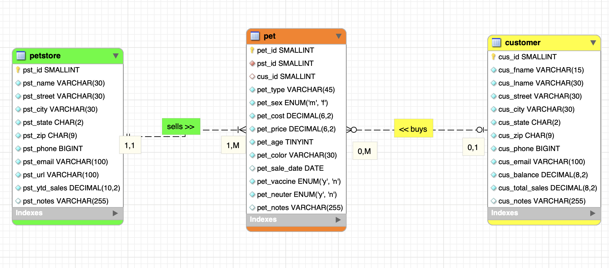
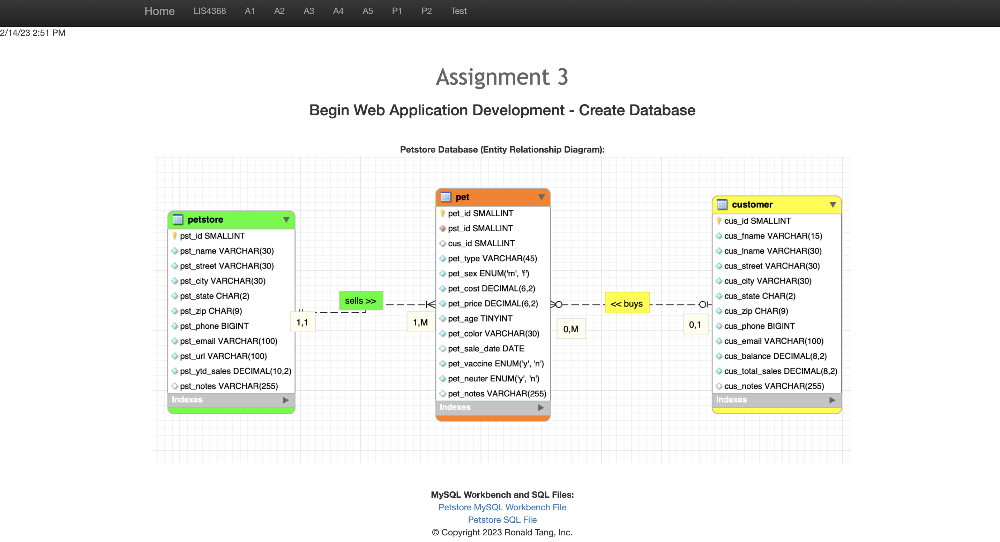
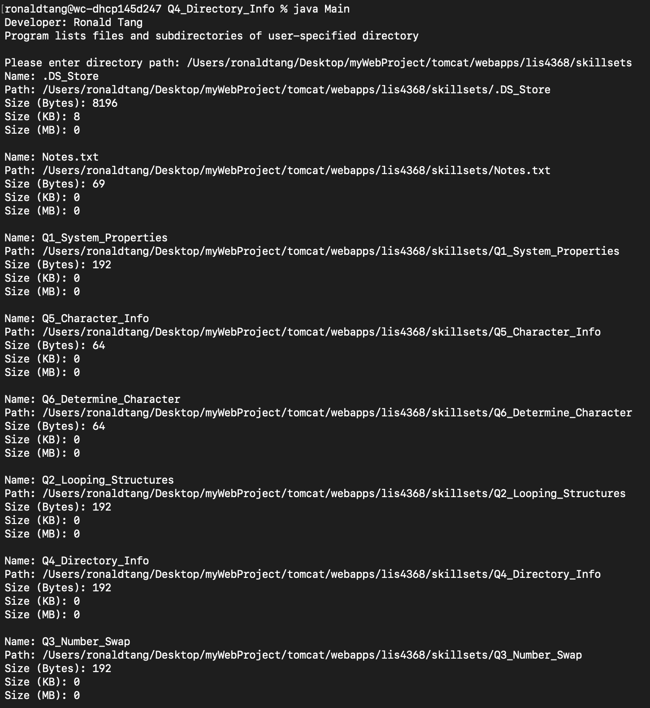
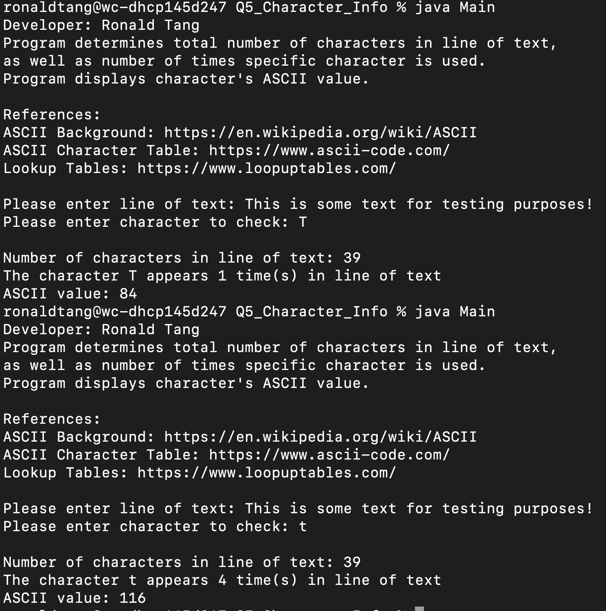
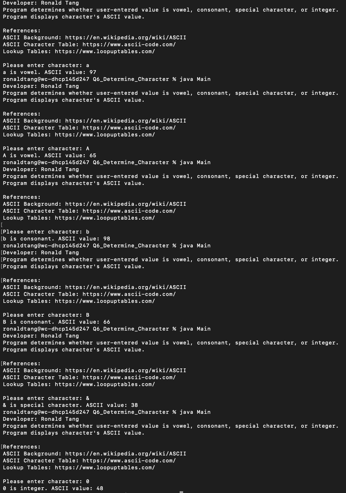

# LIS 4368 - Advanced Web Applications Development 

## Ronald Tang

### Assignment 3 Requirements:

*Three parts:*

1. Create a petstore table, pet table, and customer table
2. Each table requires at least 10 records, and be able to forward-engineer locally
3. Create an ERD for the database

#### README.md file should include the following items:

* Screenshot of ERD
* Screenshot of a3/index.jsp
* Links to the following items:
    * a3.mwb
    * a3.sql

#### Assignment Screenshots:

| Screenshot of ERD | Screenshot of A3 index.jsp
| ---------- | ---------- |
|  |  |

*A3 docs: a3.mwb and a3.sql*: 

[A3 MWB File](docs/a3.mwb "A3 ERD in .mwb format") 
 
[A3 SQL File](docs/a3.sql "A3 SQL Script")  

| Skillset 4 | Skillset 5 | Skillset 6 |
| ---------- | ---------- | ---------- |
|  |  |  |

#### Bitbucket Link:

*Remote repository:*
[My Remote Repository ](https://bitbucket.org/ronaldtang1/lis4368/ "My Remote Repository")