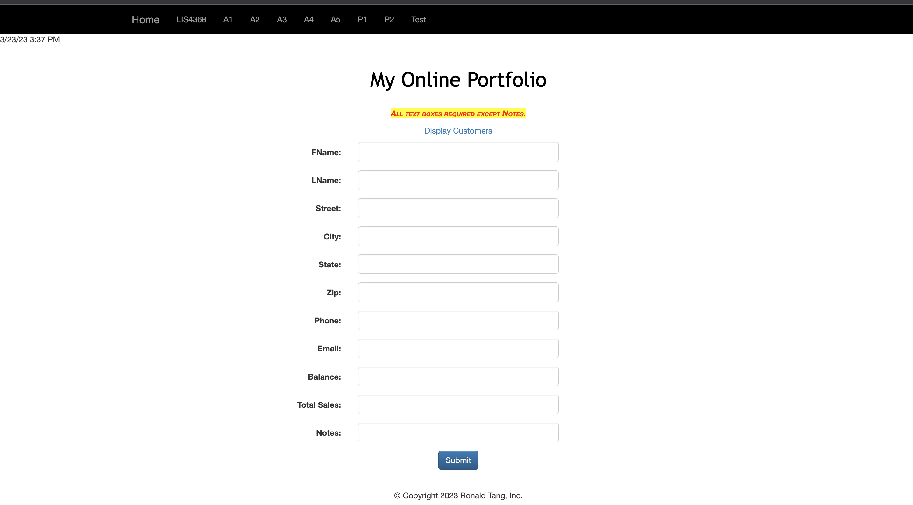
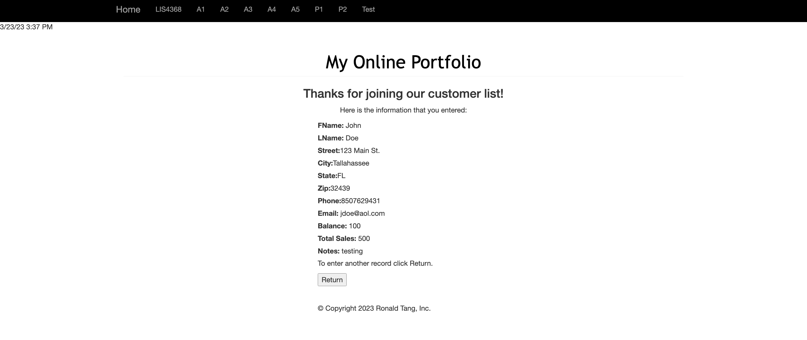
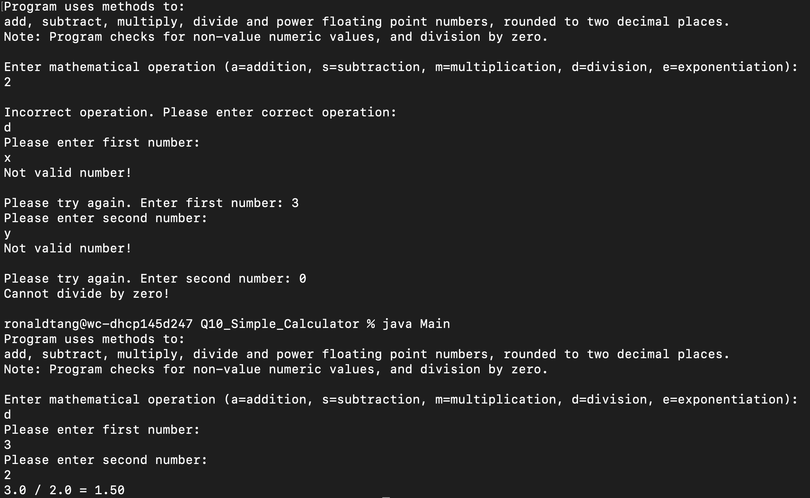
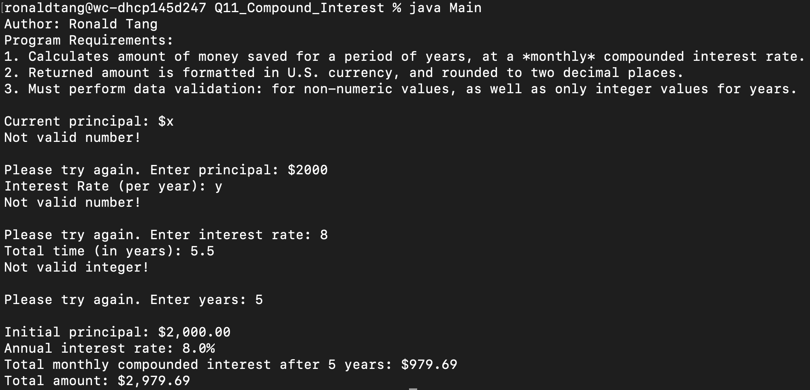
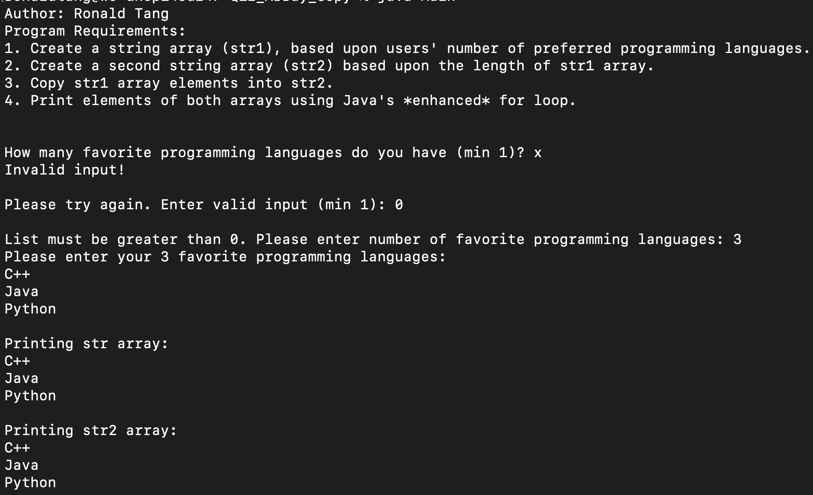

# LIS 4368 - Advanced Web Applications Development 

## Ronald Tang

### Assignment 4 Requirements:

*Three parts:*

1. Provide Bitbucket read-only access to lis4368 repo, include links to the other assignment repos you created in README.md, using Markdown syntax (README.md must also include screenshots as per above.)
2. Blackboard Links: lis4368 Bitbucket repo

#### README.md file should include the following items:

* Course title, your name, assignment requirements, as per A1;
* Screenshot of Failed Validation
* Screenshot of Passed Validation
* Screenshot of Skillsets 10, 11, 12

#### Assignment Screenshots:

| Screenshot of Failed Validation | Screenshot of Passed Validation |
| ---------- | ---------- |
|  |  |

| Skillset 10 | Skillset 11 | Skillset 12 |
| ---------- | ---------- | ---------- |
|  |  |  |

#### Remote Repository:

*Remote repository:*
[My Remote Repository ](https://bitbucket.org/ronaldtang1/lis4368/ "My Remote Repository")