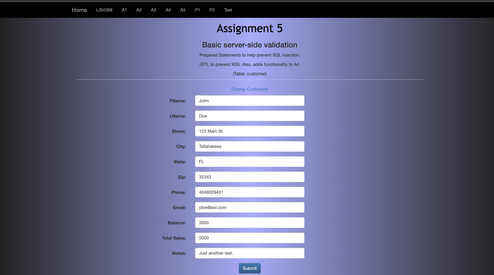
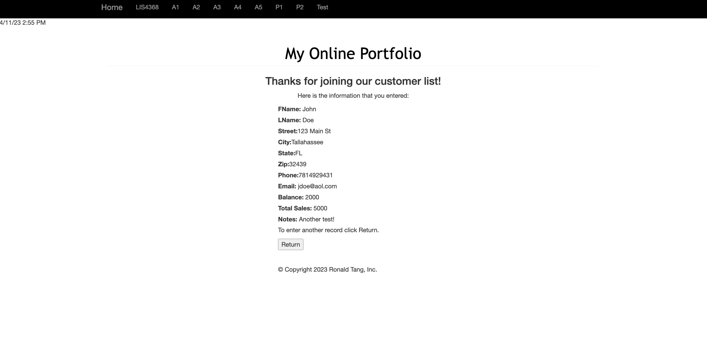
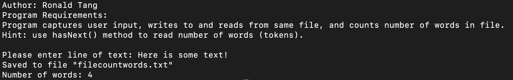
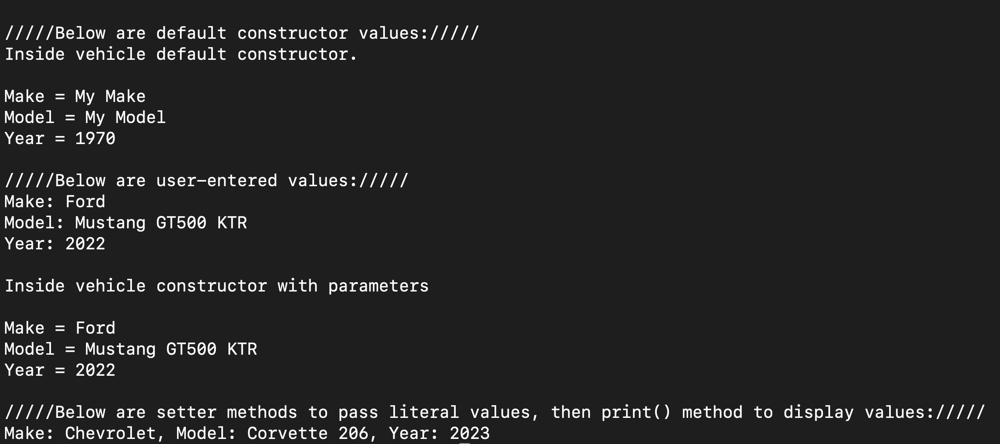
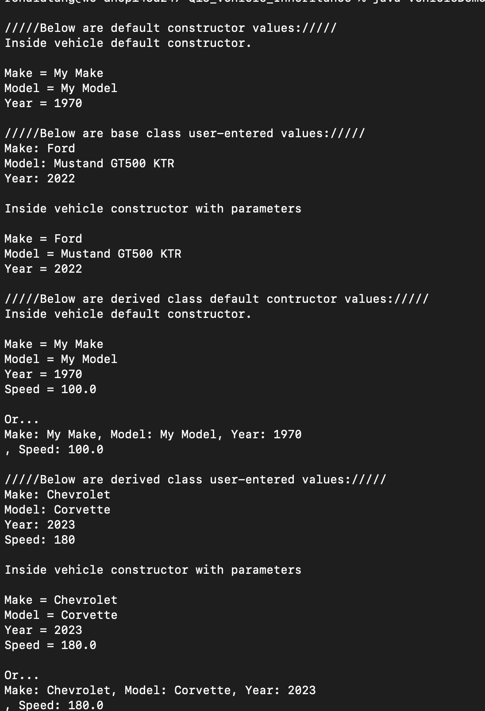

# LIS 4368 - Advanced Web Applications Development 

## Ronald Tang

### Assignment 5 Requirements:

*Three parts:*

1. Provide Bitbucketread-only access to lis4368repo, include links to the other assignment repos you created in README.md, using Markdownsyntax(README.mdmust also include screenshots as per above.)
2. Blackboard Links:lis4368 Bitbucket repo
3. Skillset screenshots

#### README.md file should include the following items:

* Course title, your name, assignment requirements, as per A1;
* Screenshot of Skillsets 13 - 15
* Screenshot of Valid User Form Entry
* Screenshot of Passed Validation
* Screenshot of Associated Database Entry

#### Assignment Screenshots:

| Screenshot of Valid User Entry Form | Screenshot of Passed Validation |
| ---------- | ---------- |
|  |  |

| Skillset 13 | Skillset 14 | Skillset 15 |
| ---------- | ---------- | ---------- |
|  |  |  |

#### Remote Repository:

*Remote repository:*
[My Remote Repository ](https://bitbucket.org/ronaldtang1/lis4368/ "My Remote Repository")