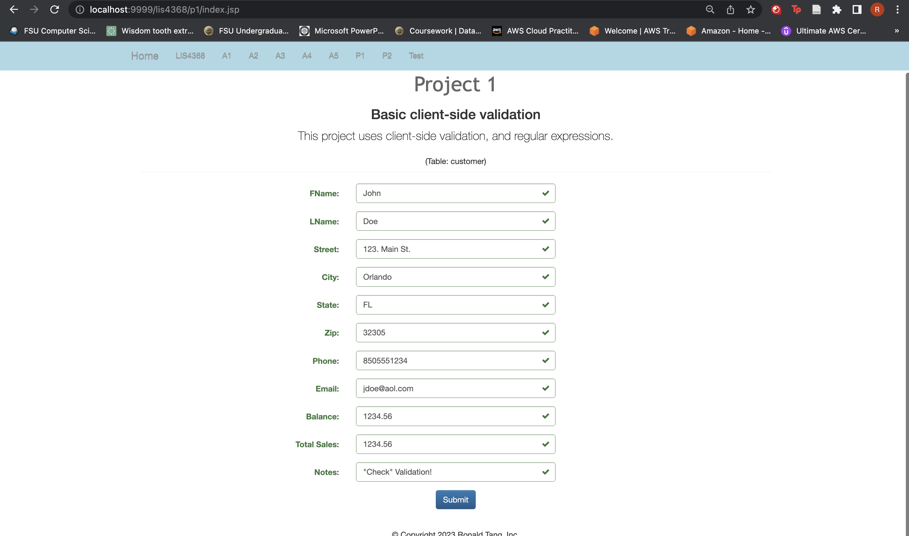

# LIS 4368 - Advanced Web Applications Development 

## Ronald Tang

### Project 1 Requirements:

*Three parts:*

1. Provide Bitbucket read-only access to lis4368 repo, include links to the other assignment repos you created in README.md, using Markdown syntax (README.md must also include screenshots as per above.)
2. Blackboard Links: lis4368 Bitbucket repo
3. Note: the carousel must contain (min. 3) slides that YOU created, that contain text and images that link to other content areas marketing/promoting your skills.

#### README.md file should include the following items:

* Course title, your name, assignment requirements, as per A1;
* Screenshot of Main/Splash page
* Screenshot of Failed Validation
* Screenshot of Passed Validation
* Screenshot of Skillsets 7, 8, 9

#### Assignment Screenshots:

*Screenshot of Main/Splash Page*:

| Screenshot of Failed Validation | Screenshot of Passed Validation |
| ---------- | ---------- |
|  |  |

*Screenshot of Skillset 7*:

*Screenshot of Skillset 8*:

*Screenshot of Skillset 9*:

#### Remote Repository:

*Remote repository:*
[My Remote Repository ](https://bitbucket.org/ronaldtang1/lis4368/ "My Remote Repository")