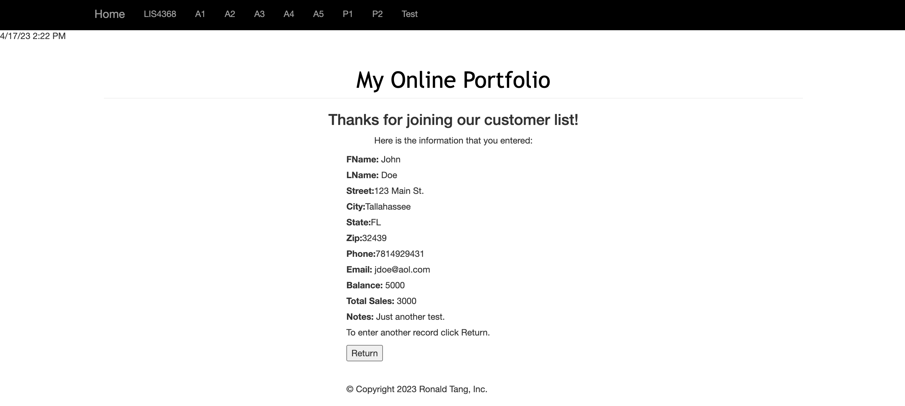

# LIS 4368 - Advanced Web Applications Development 

## Ronald Tang

### Project 2 Requirements:

*Two parts:*

1. Provide Bitbucketread-only access to lis4368repo, include links to the other assignment repos you created in README.md, using Markdownsyntax(README.mdmust also include screenshots as per above.)
2. Blackboard Links:lis4368 Bitbucket repo

#### README.md file should include the following items:

* Course title, your name, assignment requirements, as per A1;
* Screenshot of valid user form entry
* Screenshot of Passed Validation
* Screenshot of Displayed Data
* Screenshot of Modify Form
* Screenshot of Modified Data
* Screenshot of Delete Warning
* Screenshot of Associated Database Changes

#### Assignment Screenshots:

| Screenshot of Valid User Entry Form | Screenshot of Passed Validation |
| ---------- | ---------- |
|  |  |

| Screenshot of Display Data | Screenshot of Modified Form |
| ---------- | ---------- |
|  |  |

| Screenshot of Modified Data | Screenshot of Delete Warning |
| ---------- | ---------- |
|  |  |

*Screenshot of Associated Database Changes*:

#### Remote Repository:

*Remote repository:*
[My Remote Repository ](https://bitbucket.org/ronaldtang1/lis4368/ "My Remote Repository")